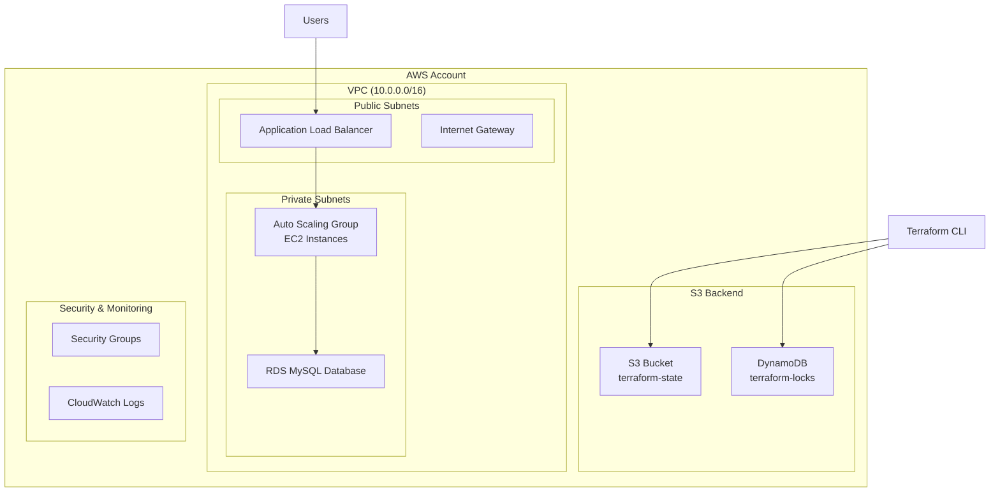

# 🚀 Terraform AWS Infrastructure Project

A production-ready AWS infrastructure project demonstrating Infrastructure as Code (IaC) best practices with multi-environment deployment, modular architecture, and security-first design.

## 📑 Table of Contents

- [🏗️ Architecture Overview](#️-architecture-overview)
- [✨ Key Features](#-key-features)
- [🚀 Quick Start](#-quick-start)
  - [Prerequisites](#prerequisites)
  - [1. Setup S3 Backend](#1-setup-s3-backend-onetime)
  - [2. Deploy Environment](#2-deploy-environment)
  - [3. Access Application](#3-access-application)
- [📁 Project Structure](#-project-structure)
- [🔧 Available Commands](#-available-commands)
- [🛡️ Security Features](#️-security-features)
- [📊 Monitoring & Logging](#-monitoring--logging)
- [🎯 What Makes This Project Stand Out](#-what-makes-this-project-stand-out)
- [🔄 Next Steps](#-next-steps)
- [📝 License](#-license)

## 🏗️ Architecture Overview



## ✨ Key Features

- **🏢 Multi-Environment**: Dev, Staging, Production
- **🔧 Modular Design**: Reusable Terraform modules
- **🔒 Security-First**: Private subnets, security groups, IAM roles
- **📊 Auto Scaling**: EC2 Auto Scaling Groups with ALB
- **🗄️ Managed Database**: RDS MySQL with high availability
- **📈 Monitoring**: CloudWatch logs and metrics
- **💾 State Management**: S3 backend with DynamoDB locking

## 🚀 Quick Start

### Prerequisites
- AWS CLI configured
- Terraform >= 1.0
- AWS Account with appropriate permissions

### 1. Setup S3 Backend (One-time)
```bash
cd environments/backend
terraform init
terraform apply -var="bucket_name=your-unique-bucket-name"
```

### 2. Deploy Environment
```bash
cd environments/dev
terraform init
terraform plan
terraform apply
```

### 3. Access Application
```bash
# Get ALB DNS name
terraform output alb_dns_name

# Access: http://your-alb-dns-name
```

## 📁 Project Structure

```
terraform_project/
├── modules/                 # Reusable Terraform modules
│   ├── vpc/               # VPC, subnets, IGW
│   ├── ec2/               # Auto Scaling Group, Launch Template
│   ├── alb/               # Application Load Balancer
│   ├── rds/               # RDS MySQL database
│   └── s3-backend/        # S3 state backend
├── environments/           # Environment-specific configs
│   ├── backend/           # S3 backend setup
│   ├── dev/              # Development environment
│   ├── staging/          # Staging environment
│   └── prod/             # Production environment
└── scripts/              # Automation scripts
```

## 🔧 Available Commands

```bash
# Setup S3 backend
make setup-backend

# Deploy environment
make plan-dev
make apply-dev

# Clean up
make destroy-dev
```

## 🛡️ Security Features

- **Private Subnets**: EC2 and RDS in private subnets
- **Security Groups**: Restrictive access controls
- **IAM Roles**: Least privilege access for EC2
- **Encryption**: S3 and RDS encryption enabled
- **VPC**: Isolated network environment

## 📊 Monitoring & Logging

- **CloudWatch Logs**: Application and system logs
- **CloudWatch Metrics**: Performance monitoring
- **Health Checks**: ALB and RDS health monitoring
- **Auto Scaling**: Automatic scaling based on metrics

## 🎯 What Makes This Project Stand Out

1. **Production-Ready**: Real-world architecture patterns
2. **Modular Design**: Easy to extend and maintain
3. **Security-First**: Industry best practices
4. **Multi-Environment**: Proper environment separation
5. **Documentation**: Clear setup and usage instructions
6. **Automation**: Scripts for common tasks

## 🔄 Next Steps

This project provides a solid foundation for:
- **Ansible Integration**: Configuration management
- **CI/CD Pipeline**: Automated deployments
- **Monitoring**: Advanced observability
- **Security**: Additional security layers

## 📝 License

This project is for educational and demonstration purposes.

---

**Ready to deploy?** Start with the [Quick Start](#-quick-start) section above! 🚀

[⬆️ Back to Top](#-terraform-aws-infrastructure-project)